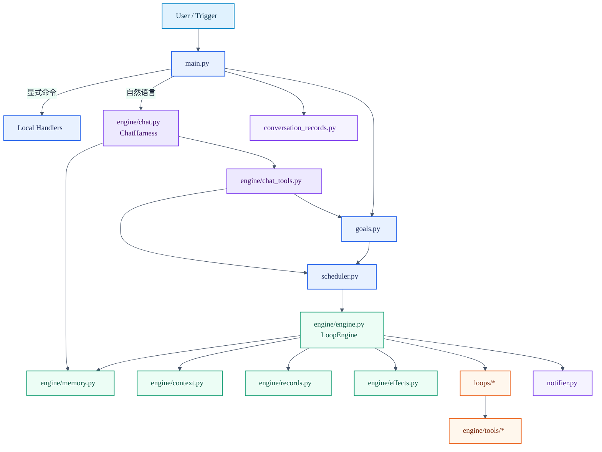
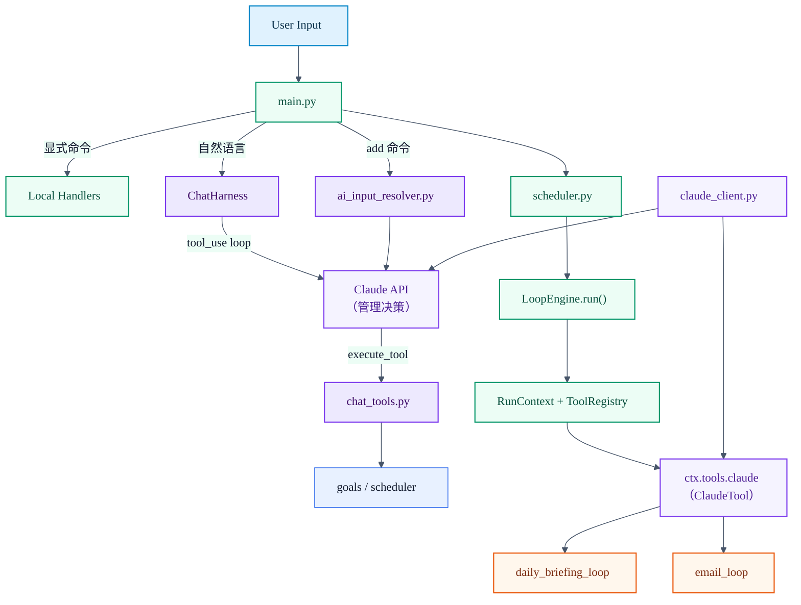
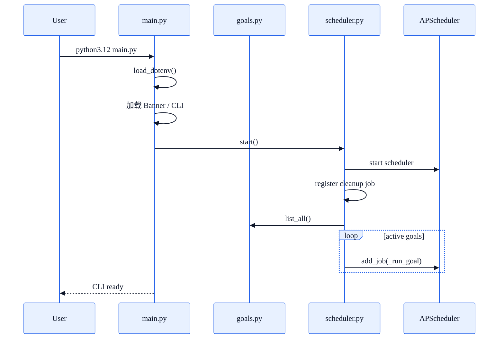
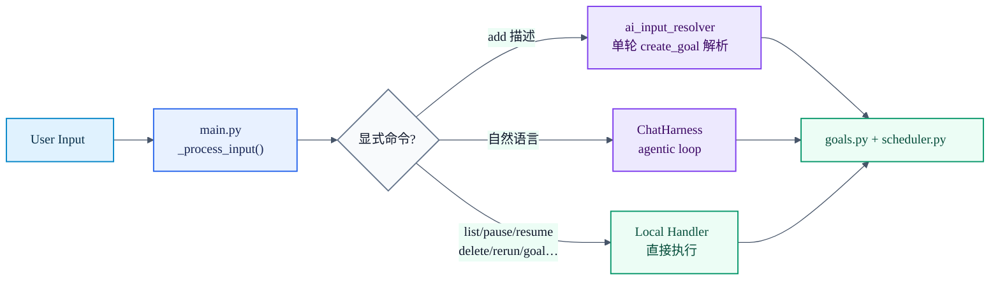
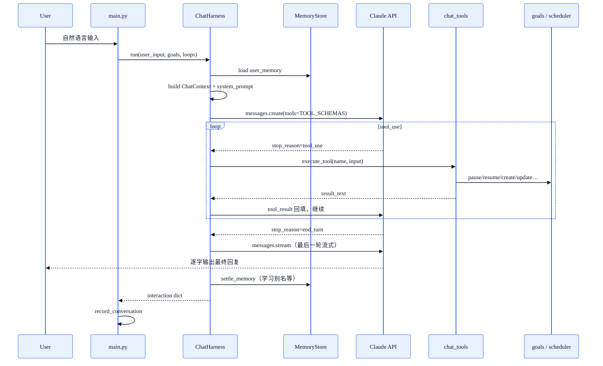
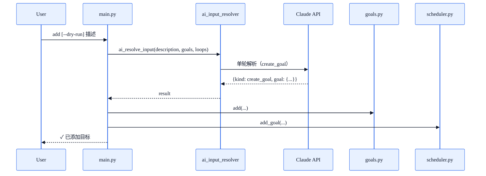
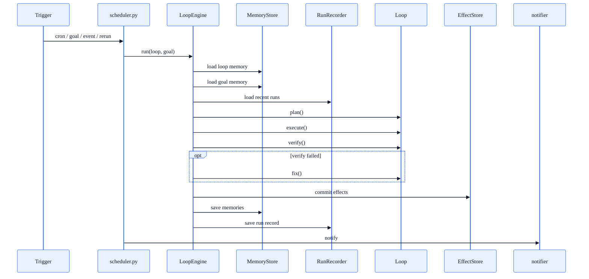
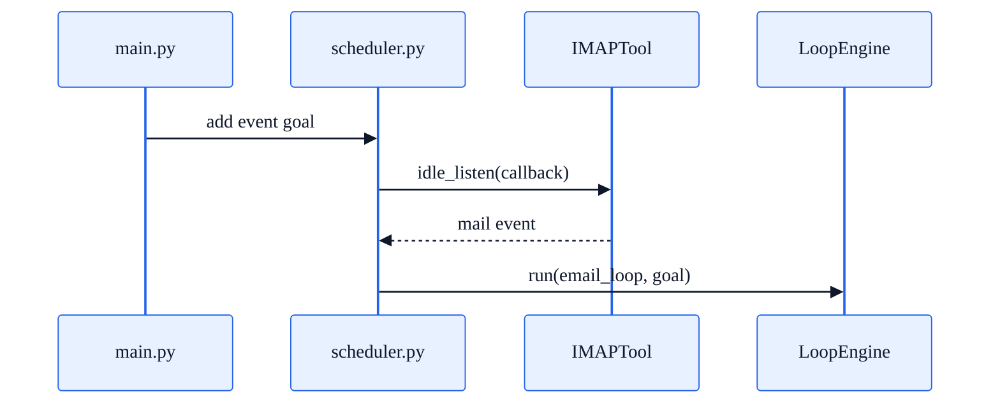

# Assistant Architecture

本文档只描述 `assistant/` 的当前运行时架构。

它回答三类问题：

- 系统由哪些层组成
- 一条输入如何流过这些层
- 哪些边界由 runtime 统一接管

使用方式和命令说明请看 [README.md](./README.md)。

## 1. 设计目标

这套 runtime 的目标不是堆积脚本，而是把“目标驱动的个人自动化”收敛成统一执行系统。

核心要求：

- 用户输入的是目标，不是函数调用
- 不同任务共享同一套执行、记录、通知、重试机制
- 业务逻辑与副作用、调度、存储分离
- 每次运行都可追踪、可排障、可回放
- 新增 Loop 时尽量不改主框架

## 2. 核心原则

### 2.1 Goal 驱动

系统先把输入收敛成 `goal`，再由 runtime 负责执行。

职责边界：

- `main.py`：输入与交互
- `goals.py`：goal 持久化
- `scheduler.py`：触发与重试
- `LoopEngine`：单次运行生命周期
- `loops/*`：业务逻辑

### 2.2 本地优先，模型兜底

输入路由顺序：

1. 显式命令（list / pause / resume / delete / rerun / add 等）
2. 自然语言输入 → ChatHarness agentic loop

原则：

- 明确的管理命令直接本地执行，不经过 AI
- 自然语言输入全部由 ChatHarness 接管，Claude 通过 tool_use 驱动执行
- `add` 命令是例外：显式触发 AI，但只做单轮 create_goal 解析

### 2.3 Loop 只管业务

Loop 不直接管理：

- 调度
- 幂等
- effect 提交
- run record 落盘
- memory 落盘
- 通知

这些统一由 `LoopEngine` 接管。

### 2.4 Output / Effect 分离

- `output`：本次运行产物
- `effect`：本次运行要提交的外部动作

这层分离保证：

- 产物可回看
- 副作用可重放
- “生成成功 / 发送失败”可分开定位

### 2.5 分层 memory

当前 memory 分层：

- `user memory`：用户长期偏好，CLI 聊天写入，仅放偏好不放记录
- `loop memory`：跨 goal 的 loop 级运行状态与偏好
- `goal memory`：单 goal 的运行状态与偏好
- `recent_runs`：最近运行轨迹
- `RUNTIME.md`：用户手动编写的全局规则
- `loops/<loop>.md`：loop 级长期规则

其中：

- JSON 保存运行时状态（程序自动写入）
- Markdown 保存长期规则（用户手动编写）
- `run_records` 保存事实历史
- `conversation_records` 保存 CLI 聊天轮次历史

### 2.6 受控增长

memory 不是历史仓库。

当前限制：

- `user memory`：`8 KB`
- `goal memory`：`8 KB`
- `loop memory`：`16 KB`
- `recent_runs`：默认最近 `5` 条
- `conversation_records`：保留最近 `3` 天，单文件 `128 KB` / `100` 条

超限后由 `MemoryStore` 自动压缩，`ConversationRecorder` 自动分片和清理。

## 3. 组件视图

### 3.1 模块职责

| 模块 | 职责 |
|---|---|
| `main.py` | CLI 入口、显式命令路由、输入分发 |
| `engine/chat.py` | CLI 聊天 agentic loop 引擎，构建 context、驱动 Claude tool_use、沉淀记忆 |
| `engine/chat_tools.py` | CLI agentic loop 的 tool schema 定义与执行器 |
| `ai_input_resolver.py` | `add` 命令专用的单轮 create_goal 解析 |
| `conversation_records.py` | CLI 聊天轮次持久化，3 天滚动保留 |
| `goals.py` | goal 持久化与状态更新 |
| `scheduler.py` | 定时触发、event 触发、失败重试 |
| `engine/engine.py` | 单次 run 主流程（LoopEngine） |
| `engine/memory.py` | memory 读写与压缩（user / loop / goal 三层） |
| `engine/records.py` | run record 落盘与清理 |
| `engine/effects.py` | effect 提交与幂等 |
| `loops/*` | 业务实现 |
| `engine/tools/*` | 外部能力封装 |

## 3.2 AI 逻辑全景

当前代码里的 AI 分为三层：

1. CLI 聊天层（ChatHarness agentic loop）
2. 引擎注入层（LoopEngine → ClaudeTool）
3. Loop 执行层（业务内容生成）

### 3.2.1 AI 分层图

### 3.2.2 CLI 聊天层（ChatHarness）

自然语言输入全部由 `ChatHarness` 接管，走 agentic loop：

1. 构建 `ChatContext`（goals、loops、user_memory、recent_conversations、RUNTIME.md）
2. 构建 system prompt，注入全量上下文
3. 进入 while 循环：
   - Claude 决策 → `tool_use`：执行 `chat_tools` 中的对应函数，回填 `tool_result`，继续循环
   - Claude 决策 → `end_turn`：最后一轮改用 streaming，边收边打，退出循环
4. 沉淀记忆（学习 goal 别名等）

可用工具：`list_goals` / `show_goal` / `pause_goal` / `resume_goal` / `delete_goal` / `rerun_goal` / `create_goal` / `update_goal_preferences` / `update_loop_preferences` / `update_user_preferences`

### 3.2.3 引擎注入层

这一层在 `LoopEngine.run()` 内完成，与 CLI 输入理解完全解耦。

职责：
- 构建 `RunContext`
- 根据 `required_tools` 构建 `ToolRegistry`
- 将 `claude` 能力注入到 `ctx.tools.claude`

### 3.2.4 Loop 执行层

这一层发生在 goal 真正运行时，Loop 通过 `ctx.tools.claude` 调用 AI。

`daily_briefing_loop`：整理资讯、生成英文短句、生成 HTML 简报、fix 阶段重新生成

`email_loop`：判断是否需要回复、生成回复正文、决定动作（回复 / 草稿 / 升级）、审查质量

### 3.2.5 Claude 调用底座

所有 AI 调用共享同一个 client 工厂：`claude_client.py::get_client()` / `get_model()`

## 4. 运行链路

### 4.1 启动链路

### 4.2 输入路由链路

### 4.3 CLI Agentic Loop 链路

### 4.4 Goal 创建链路（add 命令）

### 4.5 Goal 执行链路

### 4.6 Event 链路

## 5. 核心数据

### 5.1 Goal

`goal` 是持续任务定义。

关键字段：

- `id`
- `raw`
- `loop`
- `status`
- `schedule`
- `trigger_mode`
- `goal_condition`
- `dry_run`
- `retry_*`
- `failure_count`
- `last_run`
- `last_result`
- `last_run_meta`

### 5.2 Run Record

`run_records/<goal_id>_<loop_name>_<YYYY-MM-DD>.json`

职责：

- 保存当日该 goal 的运行事实
- 作为排障主入口
- 为 `recent_runs` 提供短期上下文

### 5.3 Memory

| 层级 | 路径 | 写入方 | 职责 |
|---|---|---|---|
| `user memory` | `memory/user/user.json` | ChatHarness | 用户长期偏好、goal 别名 |
| `loop memory` | `memory/loops/<loop>.json` | LoopEngine / ChatHarness | loop 级运行状态与偏好 |
| `goal memory` | `memory/goals/<goal_id>.json` | LoopEngine / ChatHarness | goal 级运行状态与偏好 |
| `recent_runs` | `run_records/` | LoopEngine | 运行事实历史 |
| `conversation_records` | `conversation_records/` | main.py | CLI 聊天轮次历史 |
| `RUNTIME.md` | `RUNTIME.md` | 用户手动 | 用户全局规则（声明式） |
| `loops/<loop>.md` | `loops/<name>.md` | 用户手动 | loop 级长期规则（声明式） |

## 6. 触发模式

| 模式 | 说明 | 典型场景 |
|---|---|---|
| `cron` | 固定时间触发 | 每日简报 |
| `goal` | 未达成前持续推进 | 收件箱清零 |
| `event` | 外部事件触发 | 新邮件即时处理 |

## 7. Loop 接口

`BaseLoop` 的核心钩子：

- `plan(goal, ctx=None)`
- `execute(context, ctx=None)`
- `verify(result)`
- `fix(result, issues, ctx=None)`
- `report(result)`

常用扩展钩子：

- `extract_memory(result, old_memory)`
- `extract_goal_memory(result, old_memory)`
- `is_goal_met(result, memory)`
- `next_trigger(result)`

## 8. 新增 Loop 的开发步骤

1. 执行 `init loop <name>`
2. 实现 `BaseLoop` 子类
3. 声明 `name`、`description`、`required_tools`
4. 实现 `plan / execute / verify / report`
5. 需要长期规则时再补 `loops/<name>.md`
6. 需要持久状态时实现 memory 抽取钩子
7. 增加测试

## 9. 边界总结

系统边界保持为：

- 显式命令路由在 `main.py`
- 自然语言交互在 `engine/chat.py + engine/chat_tools.py`
- goal 创建解析在 `ai_input_resolver.py`（仅 add 命令）
- 目标存储在 `goals.py`
- 触发与重试在 `scheduler.py`
- 单次运行生命周期在 `LoopEngine`
- 业务实现只在 `loops/*`
- 外部世界接入只在 `engine/tools/*`
- memory 读写只通过 `MemoryStore`

这组边界是当前 runtime 最重要的稳定面。
