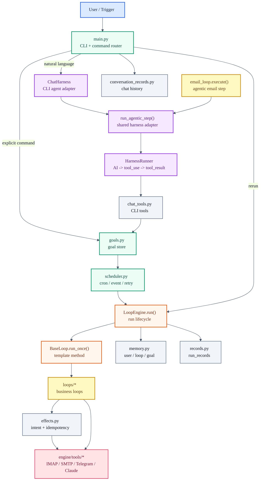
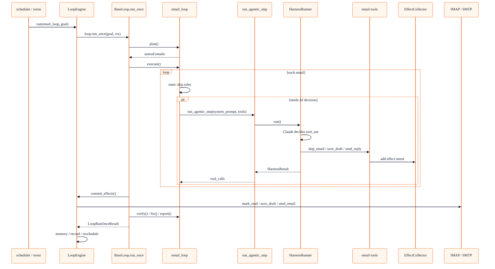
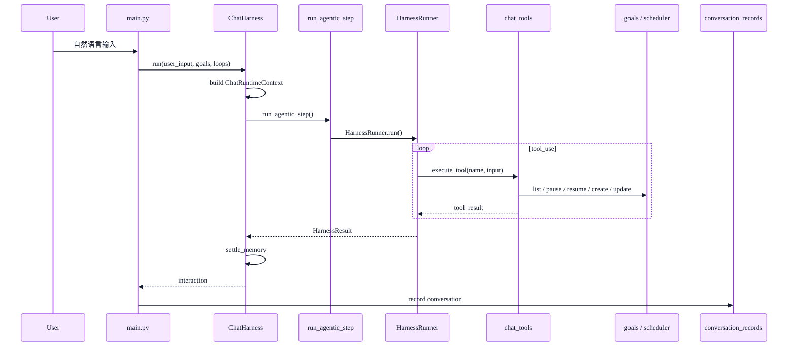
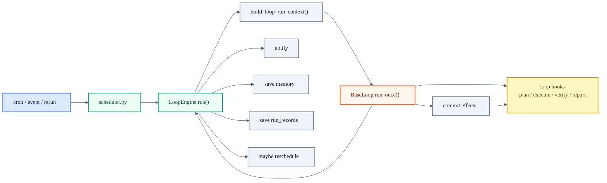

# Assistant Architecture

本文档描述 `assistant/` 的当前运行时架构。它关注代码边界、执行链路和扩展方式；CLI 使用说明见 [README.md](./README.md)。

## 1. 架构定位

Neil Assistant 是一个目标驱动的个人自动化运行时。

核心不是“写一堆脚本”，而是把用户目标沉淀成 `goal`，再由统一 runtime 负责触发、执行、记录、通知、记忆和重试。

当前架构由两条能力线组成：

| 能力 | 解决的问题 | 核心代码 |
|---|---|---|
| `Loop` | 目标如何持续推进 | `LoopEngine` + `BaseLoop.run_once()` |
| `Harness` | AI 如何多轮调用工具完成一步任务 | `HarnessRunner` + `run_agentic_step()` |

一句话：

```text
Loop 负责目标闭环，Harness 负责智能执行步骤。
```

## 2. 总览



## 3. 核心分层

| 层 | 模块 | 职责 |
|---|---|---|
| CLI | `main.py` | 输入循环、显式命令、本地输出、对话记录 |
| Chat Harness | `engine/chat.py` | 将自然语言管理请求转成 agentic step |
| Harness Core | `engine/agentic_step.py`, `engine/harness.py` | AI 多轮工具调用底座 |
| Goal Store | `goals.py` | goal 创建、状态、失败计数、最近结果 |
| Scheduler | `scheduler.py` | cron、event、立即执行、失败重试 |
| Loop Runtime | `engine/engine.py` | 单次 run 生命周期、记录、通知、记忆、重调度 |
| Loop Template | `loops/base.py` | 模板方法，固定单次 loop 闭环 |
| Business Loops | `loops/*` | 具体业务逻辑 |
| Effects | `engine/effects.py` | 副作用意图、幂等 key、统一提交 |
| Memory | `engine/memory.py` | user / loop / goal memory 读写与压缩 |
| Records | `engine/records.py` | run_records 按 goal + loop + 日期落盘 |

## 4. Loop 架构

Loop 处理的是目标推进，不是单次函数调用。

标准闭环：

```text
goal
-> plan
-> execute
-> effects
-> verify / fix
-> report
-> memory
-> is_goal_met / next_trigger
```

### 4.1 模板方法

模板方法在 [BaseLoop.run_once()](./loops/base.py)。

它固定单次 loop 的内部骨架：

```text
BaseLoop.run_once(goal, ctx, commit_effects)
  -> plan(goal, ctx)
  -> execute(context, ctx)
  -> commit_effects(...)
  -> after_effects(...)
  -> verify(result)
  -> fix(result, issues, ctx) if needed
  -> report(result)
```

子类只实现变化点：

| 方法 | 职责 |
|---|---|
| `plan()` | 准备本次执行上下文 |
| `execute()` | 执行业务动作，可选择普通代码或 harness |
| `verify()` | 验证结果是否可接受 |
| `fix()` | 修复失败结果 |
| `report()` | 生成摘要，不直接通知 |
| `after_effects()` | effect 提交后刷新衍生状态 |
| `extract_memory()` | 写 loop 级记忆 |
| `extract_goal_memory()` | 写 goal 级记忆 |
| `is_goal_met()` | 判断目标是否完成 |
| `next_trigger()` | 未完成时给出下次触发时间 |

### 4.2 LoopEngine

[LoopEngine.run()](./engine/engine.py) 是系统级主入口，不是模板方法。

它负责外围生命周期：

```text
LoopEngine.run(loop, goal)
  -> build_loop_run_context()
  -> loop.run_once()
  -> notify
  -> save loop memory
  -> save goal memory
  -> maybe reschedule
  -> save run record
```

边界：

| LoopEngine 负责 | BaseLoop 负责 |
|---|---|
| 构建 `RunContext` | 固定阶段顺序 |
| 注入 tools / memory / recent_runs / docs | 调用子类业务钩子 |
| 提交 effects | 生成 effect 意图 |
| 通知 | 生成通知请求 |
| memory 落盘 | memory 内容抽取 |
| run_records 落盘 | phase_data 生成 |
| goal 重调度 | `is_goal_met()` / `next_trigger()` 判断 |

## 5. Harness 架构

Harness 处理的是 AI 多轮工具调用。

核心循环在 [HarnessRunner](./engine/harness.py)：

```text
while iteration < max_iterations:
    Claude(messages, tools)

    if stop_reason == tool_use:
        execute_tool(name, input)
        append tool_result
        continue

    if stop_reason == end_turn:
        return final_text
```

### 5.1 通用入口

[run_agentic_step()](./engine/agentic_step.py) 是 CLI 和 Loop 共用的轻量适配层。

它负责装配：

| 参数 | 含义 |
|---|---|
| `system_prompt` | 当前 agentic step 的规则 |
| `messages` | 当前输入 |
| `tools` | Claude tool schema |
| `execute_tool` | 本地工具执行函数 |
| `metadata` | run 级稳定信息 |
| `direct_tools` | 调用后可直接结束的工具 |
| `hooks` | 可选生命周期回调 |

### 5.2 为什么不复用 ChatHarness

`ChatHarness` 是 CLI 管理场景适配器，绑定了 goals、loops、chat_tools、conversation_records、用户记忆沉淀等逻辑。

Loop 内部不应该复用 `ChatHarness`，而应该复用更底层的 `run_agentic_step()`。

```text
HarnessRunner
  <- run_agentic_step()
      <- ChatHarness
      <- email_loop.execute()
      <- future agentic loops
```

## 6. Loop + Harness

Loop 和 Harness 的组合点在 `execute()` 或 `fix()`。

```text
BaseLoop.run_once()
  -> execute()
      -> 普通 loop：直接业务代码
      -> agentic loop：run_agentic_step()
  -> verify()
  -> report()
```

这保证：

| 设计点 | 结果 |
|---|---|
| Loop 不被 Harness 替代 | 目标闭环仍然稳定 |
| Harness 不接管 Engine | AI 只负责某一步智能执行 |
| Effects 仍由 Engine 提交 | dry-run、幂等、记录保持一致 |
| 普通 loop 不强制 agentic | 简单任务仍然简单 |

### 6.1 email_loop 当前实现

`email_loop` 是当前第一个 Loop + Harness 实现。

执行链路：



email harness 暴露的工具：

| Tool | Effect | 用途 |
|---|---|---|
| `skip_email` | `mark_read` | 无需回复，标记已读 |
| `save_draft` | `save_draft_and_mark_read` | 生成草稿，等待人工确认 |
| `send_reply` | `send_email_and_mark_read` | 低风险且允许自动发送时直接回复 |

注意：这些工具不直接操作邮箱，只登记 effect。真正副作用仍由 `LoopEngine` 统一提交。

## 7. CLI 链路

CLI 分两种输入。

### 7.1 显式命令

```text
user input
-> main.py
-> local handler
-> goals / scheduler / LoopEngine
```

典型命令：

```text
list
pause <goal_id>
resume <goal_id>
delete <goal_id>
rerun <goal_id>
add <goal description>
```

### 7.2 自然语言

自然语言进入 CLI harness。



## 8. Goal 执行链路



## 9. Memory 与 Records

### 9.1 Memory 分层

| 层级 | 路径 | 内容 | 写入方 |
|---|---|---|---|
| User memory | `memory/user/user.json` | 用户长期偏好、goal 别名 | `ChatHarness` |
| Loop memory | `memory/loops/<loop>.json` | loop 级偏好、聚合状态 | `LoopEngine`, `ChatHarness` |
| Goal memory | `memory/goals/<goal_id>.json` | goal 专属偏好、近期状态 | `LoopEngine`, `ChatHarness` |
| Runtime doc | `RUNTIME.md` | 用户手写全局规则 | 用户 |
| Loop doc | `loops/<loop>.md` | loop 级手写规则 | 用户 |

原则：

```text
JSON memory = 程序自动维护的状态
Markdown docs = 用户手写的长期规则
run_records = 事实历史
conversation_records = 对话历史
```

### 9.2 Run Records

`run_records` 保存 loop 执行事实，不保存 CLI 对话。

当前命名策略：

```text
run_records/<goal_id>_<loop_name>_<YYYY-MM-DD>.json
```

内容包括：

| 字段 | 说明 |
|---|---|
| `run_id` | 本次运行 ID |
| `goal_id` | 对应 goal |
| `loop_name` | 对应 loop |
| `phase_data` | plan / execute / effects / verify / report 阶段数据 |
| `planned_effects` | 计划副作用 |
| `committed_effects` | 提交结果 |
| `memory_before/after` | loop memory 变化 |
| `goal_memory_before/after` | goal memory 变化 |
| `notifications` | 通知结果 |
| `next_trigger_in_seconds` | 目标未完成时的下次触发 |

### 9.3 Conversation Records

`conversation_records` 保存 CLI 聊天历史，用于自然语言上下文。

它与 `run_records` 分离：

| 类型 | 保存什么 |
|---|---|
| `run_records` | loop 执行事实 |
| `conversation_records` | 用户输入、AI tool_calls、AI 回复、执行结果 |

## 10. Effect 机制

Loop 不直接提交外部副作用，而是声明 effect。

```text
loop.execute()
  -> ctx.effects.add(...)

BaseLoop.run_once()
  -> commit_effects callback

LoopEngine
  -> _apply_effect()
  -> mark seen for idempotency
```

常见 effect：

| Effect | 外部动作 |
|---|---|
| `mark_read` | IMAP 标记已读 |
| `send_email_and_mark_read` | SMTP 发送 + IMAP 标记已读 |
| `save_draft_and_mark_read` | IMAP 保存草稿 + 标记已读 |
| `send_telegram_document` | Telegram 发送文件 |

效果：

```text
dry_run 可控
幂等可控
失败可记录
生成与提交可分离
```

## 11. 触发模式

| 模式 | 说明 | 典型场景 |
|---|---|---|
| `cron` | 固定时间触发 | 每日简报 |
| `goal` | 未达成前持续推进 | 收件箱清零 |
| `event` | 外部事件触发 | 新邮件触发 email_loop |

## 12. 新增 Loop

新增普通 loop：

1. 执行 `init loop <name>`
2. 新建 `BaseLoop` 子类
3. 声明 `name`、`description`、`required_tools`
4. 实现 `plan / execute / verify / fix / report`
5. 需要通知时实现 `build_notifications`
6. 需要目标推进时实现 `is_goal_met / next_trigger`
7. 需要记忆时实现 `extract_memory / extract_goal_memory`
8. 增加测试

新增 agentic loop：

1. 仍然先实现 `BaseLoop` 子类
2. 在 `execute()` 或 `fix()` 内调用 `run_agentic_step()`
3. 为该 step 定义专属 tool schema
4. tool executor 只登记 effect 或返回内部结果
5. 由 `LoopEngine` 统一提交 effect、写 record、写 memory

最小形态：

```python
def execute(self, context, ctx):
    result = run_agentic_step(
        system_prompt="...",
        messages=[{"role": "user", "content": "..."}],
        tools=[...],
        execute_tool=lambda name, inp: self._execute_tool(name, inp, ctx),
        run_id=ctx.run_id,
        metadata={"loop": self.name},
    )
    return {"tool_calls": result.tool_calls}
```

## 13. 边界总结

| 边界 | 稳定规则 |
|---|---|
| CLI | 显式命令本地处理，自然语言进 `ChatHarness` |
| ChatHarness | 只做 CLI 适配，不给 loop 复用 |
| run_agentic_step | CLI 和 loop 共用的 harness 入口 |
| HarnessRunner | 只负责 AI tool-use 循环 |
| LoopEngine | 只负责 run 生命周期 |
| BaseLoop | 只负责模板方法 |
| Loop 子类 | 只负责业务逻辑和业务工具 |
| Effects | 所有外部副作用统一登记、统一提交 |
| Memory | 状态和偏好通过 MemoryStore 管理 |
| Records | loop 执行事实进入 run_records，对话进入 conversation_records |

当前最重要的架构判断：

```text
不要把 LoopEngine 改成 Harness。
不要让 ChatHarness 进入业务 loop。
需要 AI 多轮工具调用的 loop，在 execute/fix 内使用 run_agentic_step。
```
