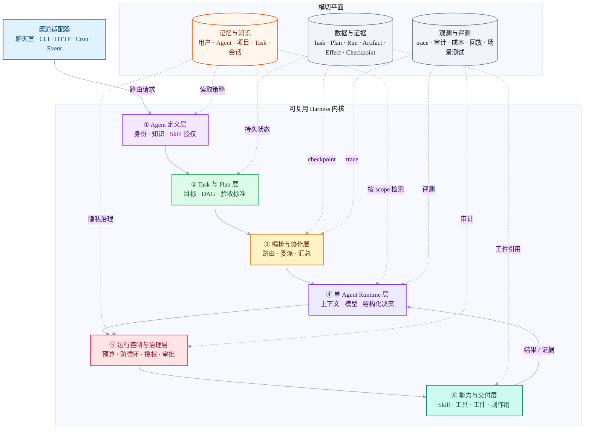
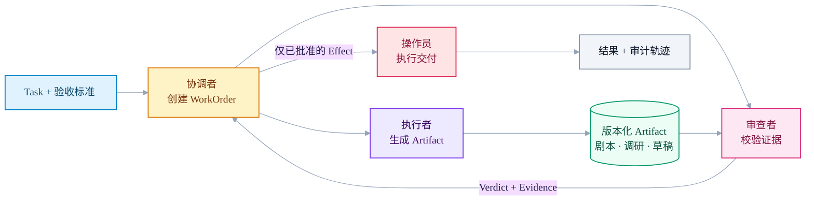
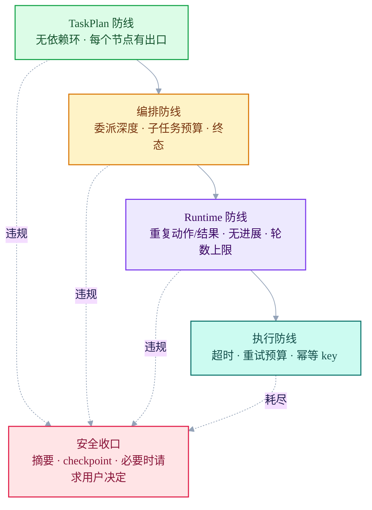

# 标准 Harness Agent 架构

> 状态：`draft-02`  
> 目标：构建一套可复用的 Harness 内核，承载聊天助手、AI 短剧制作 Agent、自动化 Agent 及未来的 Agent 产品，而不是为每种 Agent 复制一套循环。

## 1. 架构定位

这个系统不是若干 Prompt 加工具的聊天循环，而是一个**受控的 Agent 运行时**：

- Agent 产品声明自己的身份、知识策略、Skill 与所申请的能力；
- Task 与 Plan 描述需要长期推进的工作；
- Harness 负责让工作以可控、可恢复、可审计的方式运行和交付。

模型可以提出下一步动作，但永远不拥有最终执行权限。

## 2. 六层架构

六层代表职责边界，并不意味着要拆成六个服务。运行时允许在“Agent Runtime”和“能力执行”之间多轮往返。



### 2.1 每层的唯一职责

| 层 | 负责什么 | 不负责什么 |
|---|---|---|
| ① Agent 定义层 | 当前启用哪个 Agent 产品；其身份、知识策略、Skill 授权、申请能力、默认工作流 | 实际权限裁决或工具实现 |
| ② Task 与 Plan 层 | Task、持久化 TaskPlan、依赖图、验收标准、计划版本与重规划 | 模型临时的思考过程 |
| ③ 编排与协作层 | 调度计划节点、选择单/多 Agent、委派、汇总、暂停与恢复 | 供应商相关的模型调用或直接外部副作用 |
| ④ 单 Agent Runtime 层 | 隔离的 Agent 上下文、模型调用、结构化决策、本地动作提议 | 修改全局计划或提升权限 |
| ⑤ 运行控制与治理层 | 防循环、时间/成本/并发预算、取消、能力授权、风险与审批 | 业务内容创作或外部 API 细节 |
| ⑥ 能力与交付层 | Skill 实现、工具适配、工件生成、重试分类、幂等副作用 | 决定一个动作是否被允许 |

渠道适配器刻意放在六层之外。聊天室、CLI、HTTP API 或 Scheduler 只把自己的输入转换为 `IncomingRequest`，不能定义 Agent 的业务逻辑。因此同一个 `chat_assistant` 可以运行在多个渠道；`short_drama_producer` 则可同时拥有聊天入口和项目工作台。

## 3. 持久化领域对象

架构应先从长期存在的对象出发，而不是从类或 Prompt 出发：

```text
Task      = 预期结果、约束、负责人、验收标准
Plan      = 推进 Task 的版本化依赖图
Run       = 推进某个计划节点的一次尝试
Agent     = 接收边界明确 WorkOrder 的已配置执行者
Artifact  = 可版本化的证据或产物：剧本、调研、图片、草稿
Effect    = 改变外部世界的动作：发送、发布、保存、提交
```

三种“计划”必须严格分开：

| 计划 | 所属层 | 持久化 | 示例 |
|---|---|---|---|
| `TaskPlan` | ② | 必须持久化、可版本化 | “写剧集 → 审查连续性 → 生成分镜” |
| `ExecutionPlan` | ③ | 必须 checkpoint | “将第 3 场交给编剧，再交给审查者” |
| `ReasoningPlan` | ④ | 短暂存在或压缩摘要 | “先读取角色 bible，再设计冲突” |

Agent 可以提出 `PlanPatch`，但不能直接修改全局 `TaskPlan`。第 ② 层负责校验并版本化被接受的变更，让项目始终可解释、可恢复。

## 4. Agent 定义层：让产品不同，但不复制 Harness

每个 Agent 产品都是版本化的 `AgentDefinition`，被组合进共享运行时，而不是拥有一套独立的循环。

```python
@dataclass(frozen=True)
class AgentDefinition:
    id: str
    version: str
    identity: IdentityProfile
    task_types: list[TaskType]
    knowledge_policy: KnowledgePolicy
    skill_grants: set[str]
    capability_grants: set[str]
    workflow_template: WorkflowTemplate
    governance_profile: GovernanceProfile
    presentation_profile: PresentationProfile
```

第一层因此可以让不同 Agent 有真正的产品差异：

| Agent 产品 | 主要任务形态 | 典型 Skill | 主要交付 |
|---|---|---|---|
| `chat_assistant` | 短时、回合制 Task | 对话、检索、简单动作 | 回复或简洁结果 |
| `short_drama_producer` | 长周期项目 Plan | 故事 bible、剧本、分镜、生成、连续性审查 | 版本化制作工件 |
| `email_automation` | 周期性运营 Task | 读信、分类、起草、发送 | Effect 与可审计结果 |

但第一层不能授予未经校验的权限。有效能力始终是以下交集：

```text
有效能力
= AgentDefinition 声明的能力
∩ 用户 / 租户权限
∩ 当前 Task scope
∩ 环境策略
∩ 必要的审批结果
```

### 知识是策略，不是巨型 System Prompt

| 知识类别 | 示例 | 访问规则 |
|---|---|---|
| 共享核心规则 | 安全、输出规范、平台行为 | 所有 Agent 都可使用 |
| Agent 专属知识 | 剧本结构、品牌语气、工具手册 | 由 `knowledge_policy` 选择 |
| Task / 项目证据 | 角色 bible、当前剧本、历史审查意见 | 通过版本化 Artifact 精确引用 |
| 用户与会话记忆 | 偏好、活跃对话上下文 | 受用户、Task 和保留规则限制 |

这样既避免短剧项目依赖一份巨大且陈旧的 Prompt，也避免一个 Agent 的私有上下文泄漏到其他 Agent 的 WorkOrder 中。

## 5. Skill 与能力

Skill 是可复用、可版本化的工作单元。Agent 定义层负责授权它，⑥ 层负责实现它。

```python
@dataclass(frozen=True)
class SkillManifest:
    id: str
    version: str
    input_schema: dict
    output_schema: dict
    required_capabilities: set[str]
    readable_artifact_types: set[str]
    produced_artifact_types: set[str]
    acceptance_checks: list[str]
    risk_level: str
```

示例：

- `write_episode_script` 消费故事 bible，产出版本化剧本 Artifact；
- `review_continuity` 消费剧本和角色事实，产出带证据的结构化 Verdict；
- `send_email` 消费已批准草稿，创建一个幂等的外部 Effect。

Skill 永远不能绕过控制层。即使 Agent 被授予了 `send_email` Skill，在一个具体 Run 中依然可能被拒绝、限流或转入审批。

## 6. 单 Agent 与多 Agent：两种编排模式

多 Agent 不是新运行时，也不是模型之间的群聊。它是第 ③ 层基于同一套 Runtime 和类型化交接协议构建的协作拓扑。



初始职责集合应保持很小：

| 角色 | 权限边界 |
|---|---|
| Planner | 提出或修订 `TaskPlan`；不能直接产生外部 Effect |
| Coordinator | 生成 WorkOrder、调度和汇总；不能静默篡改全局事实 |
| Worker | 完成一个边界明确的 Task 节点并产出 Artifact；不能改写全局 Plan |
| Reviewer | 依据验收标准返回 Verdict 与证据；不能审批自己创建的产物 |
| Operator | 执行已授权的 Effect；不能决定策略或修改内容 |

Agent 只能通过类型化对象协作：`WorkOrder`、`Artifact`、`ReviewVerdict`、`PlanPatch`、`EffectIntent`。自由形式的 Agent 对话不是系统契约。

默认使用单 Agent。仅当满足以下任一条件时才升级为多 Agent：

- Plan 中有可独立执行的节点；
- 创作和审查必须彼此独立；
- 不同节点需要不同的知识、模型、工具范围或预算；
- 项目长期运行，需要清晰的工作归属。

## 7. 运行控制与治理

第 ⑤ 层是 Agent 自主性外侧的确定性边界，包含两个相关但不混淆的职责：

| 关注点 | 示例 | 决策 |
|---|---|---|
| 运行安全 | 最大轮数、执行时间、工具调用预算、无进展阈值、重复动作/结果、委派深度 | 继续、收口、暂停、取消 |
| 治理与授权 | 身份、能力范围、数据敏感度、收件人/域名规则、审批策略 | 允许、拒绝、要求审批 |

防止死循环需要多道闸门：



现有 `RunPolicy` 中的概念——轮数上限、工具调用上限、墙钟时间上限、重复动作/结果、无进展阈值——都属于这一层。它们必须随 Run 持久化，不能只存在于模型循环的局部变量里。

## 8. 状态、证据、记忆、观测与评测

这些是横切系统平面，因为每一层都会消费或生产它们。

| 平面 | 保存什么 | 为什么需要 |
|---|---|---|
| 数据与证据 | Task、Plan、Run、WorkOrder、Artifact、Effect、checkpoint | 恢复、溯源、审批、可复现 |
| 记忆与知识 | 用户、Agent、项目、Task、会话记忆；知识索引与访问策略 | 个性化、连续性、可控复用与知识隔离 |
| 观测与评测 | 结构化事件、trace、模型/工具版本、token/cost、场景集、回放报告 | 排障、审计、安全升级模型/Prompt/Skill |

`Artifact / Evidence` 是可追溯的原始事实和产物；`Memory` 是从这些事实中提炼出的、可检索且可被纠正的派生认知。记忆不能替代 Artifact 作为事实源，必须在适用时保留 `source_ref` 回链。

### 8.1 记忆与知识平面

记忆按作用域和生命周期分层，不能把所有聊天、模型输出或工具结果都写成长时记忆：

| 记忆类型 | 生命周期 | 例子 |
|---|---|---|
| 工作记忆 | 单个 Run | 当前工具结果、阶段摘要、临时上下文 |
| 会话记忆 | 一个 thread | 正在讨论的方案、近期对话上下文 |
| 用户记忆 | 跨会话 | 语言偏好、审批习惯、稳定偏好 |
| Agent 记忆 | 某 Agent 跨 Task | 已验证的工作方法、可复用风格偏好 |
| 项目 / Task 记忆 | 一个项目或 Task | 角色关系、剧情事实、通过的决策、失败原因 |

每条记忆至少应拥有以下契约：

```python
@dataclass(frozen=True)
class MemoryRecord:
    scope: str          # user / agent / project / task / thread / run
    kind: str           # preference / fact / decision / episode / summary
    content: dict
    source_ref: str     # 对应 Artifact、Run 或用户输入
    confidence: float
    sensitivity: str
    ttl: str | None
    version: int
    write_policy: str
```

记忆的读写规则：

- 第 ① 层的 `knowledge_policy` 声明 Agent 可读写哪些记忆域；
- 第 ② 层维护项目和 Task 的决策记忆；
- 第 ③ 层只共享 WorkOrder 所需的最小记忆，不把 Agent 上下文全部互相注入；
- 第 ④ 层按 scope 检索记忆并组装工作记忆；
- 第 ⑤ 层强制租户隔离、隐私、保留期限和写入权限；
- 第 ⑥ 层 Skill 只能产出“候选记忆”，不能绕过记忆服务直接写入全局事实。

影响项目事实的记忆必须经证据、确定性检查或 Reviewer 校验后才可提升为长期记忆；冲突、失效和用户纠正都必须保留版本记录。

最小 checkpoint 边界为：

1. `TaskPlan` 或 `ExecutionPlan` 发生变化；
2. 发出一个 WorkOrder；
3. 记录一个模型决策；
4. 提交一个工具结果或 Artifact；
5. Run 进入审批、暂停或终态；
6. 提交一个 Effect。

外部 Effect 使用 outbox 和稳定的 idempotency key。重试或恢复时，绝不能重复发送邮件或重复发布同一 Artifact。

## 9. 本仓库的实现方向

现有代码是有价值的参考，而不是目标架构本身：

| 现有组件 | 在目标架构中的位置 |
|---|---|
| `HarnessRunner`、`HarnessContextManager`、`RunPolicy` | 第 ④ 层 Runtime，以及第 ⑤ 层的运行安全部分 |
| `ChatHarness` | `chat_assistant` 的一种渠道/产品适配 |
| `BaseLoop`、`LoopEngine`、`scheduler.py` | 第 ②/③ 层的早期 Task 推进与触发基础设施 |
| `effects.py` | 第 ⑥ 层的第一版 Effect / outbox 实现 |
| memory | 记忆与知识平面的起点；需要补 scope、来源、版本与读写策略 |
| run records、conversation records | 数据与证据平面的起点 |
| `engine/tools/*` | Skill Registry 下方的能力适配器 |

第一个实现里程碑不是多 Agent，而是定义持久化契约：`AgentDefinition`、`Task`、`Plan`、`Run`、`Artifact`、`Effect`、`WorkOrder`，然后让现有单 Agent Harness 使用它们。多 Agent 协作应是同一套契约上的受控扩展。

## 10. 不可妥协的规则

- Agent 不得绕过注册能力和控制闸门，直接拥有 shell、网络或发布权限。
- Worker 不能直接改全局 Plan，只能带证据提出 `PlanPatch`。
- Reviewer 不能审批自己创建的 Artifact。
- 外部 Effect 没有幂等边界不得重试。
- 审批不是 UI 特例，而是可持久化的 Run 状态。
- 模型、Prompt、Skill 或策略升级前，必须通过可回放的场景评测。
