# 标准 Harness Agent 架构

> 目标：一套可复用的 Harness 内核，承载聊天助手、AI 短剧制作、自动化等 Agent 产品，而非为每种 Agent 复制一套循环。

## 1. 架构定位

这不是"Prompt + 工具"的聊天循环，而是一个**受控的 Agent 运行时**：

- Agent 产品声明身份、知识策略、Skill 与申请的能力；
- Task 与 Plan 描述需要长期推进的工作；
- Harness 让工作以可控、可恢复、可审计的方式运行和交付。

模型可以提出下一步动作，但永远不拥有最终执行权限。

## 2. 六层架构

六层是职责边界，不意味着要拆成六个服务；运行时允许在 Runtime 与能力执行之间多轮往返。


> 左栏为接入渠道与 Agent 产品，中间六层横带自上而下是**控制流（①→⑥）**、橙色弧线是**证据回流（⑥→④）**，右栏三块为横切平面（全层可读写）。

### 2.1 每层的唯一职责

| 层 | 负责什么 | 不负责什么 |
|---|---|---|
| ① Agent 定义层 | 当前启用哪个 Agent 产品；其身份、知识策略、Skill 授权、申请能力、默认工作流 | 实际权限裁决或工具实现 |
| ② Task 与 Plan 层 | Task、持久化 TaskPlan、依赖图、验收标准、计划版本与重规划 | 模型临时的思考过程 |
| ③ 编排与协作层 | 调度计划节点、选择单/多 Agent、委派、汇总、暂停与恢复 | 供应商相关的模型调用或直接外部副作用 |
| ④ 单 Agent Runtime 层 | 隔离上下文与上下文工程、模型调用、结构化决策、本地动作提议 | 修改全局计划或提升权限 |
| ⑤ 运行控制与治理层 | 防循环、预算、能力授权、输入/输出 Guardrail、人工 interrupt 与审批 | 业务内容创作或外部 API 细节 |
| ⑥ 能力与交付层 | Skill 实现、工具适配、工件生成、重试分类、幂等副作用 | 决定一个动作是否被允许 |

渠道适配器刻意放在六层之外：它只把输入转成 `IncomingRequest`，不定义业务逻辑。因此同一个 `chat_assistant` 可跨多个渠道运行，`short_drama_producer` 可同时拥有聊天入口和项目工作台。

下面 §3 自 ① 层起，逐层详解每一层的职责、核心对象与边界；横切平面（数据/记忆/观测）单独放在 §4。

## 3. 六层详解

### 3.1 ① Agent 定义层：让产品不同，但不复制 Harness

第 ① 层决定"当前是哪个 Agent 产品在跑"。每个产品是一份版本化的 `AgentDefinition`，被组合进共享运行时，而非拥有独立循环。

```python
@dataclass(frozen=True)
class AgentDefinition:
    id: str
    version: str
    identity: IdentityProfile
    task_types: list[TaskType]
    knowledge_policy: KnowledgePolicy
    skill_grants: set[str]
    capability_grants: set[str]
    workflow_template: WorkflowTemplate
    governance_profile: GovernanceProfile
    presentation_profile: PresentationProfile
```

一份 `AgentDefinition` 由四个核心组件拼装而成——它们回答"这个 Agent 是谁、知道什么、能用什么、怎么干活"：

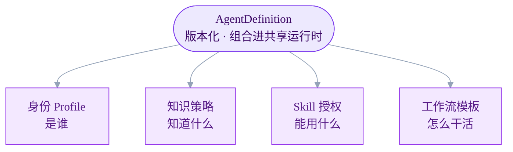

| 组件 | 字段 | 回答 | 内容 | 边界 |
|---|---|---|---|---|
| **身份 Profile** | `identity` | 是谁 | Agent 的角色定位、语气人格、目标边界、面向的任务类型 | 只定义"我是谁"，不含权限 |
| **知识策略** | `knowledge_policy` | 知道什么 | 声明可读写哪些知识域（共享规则 / 专属知识 / 项目证据 / 记忆），而非塞一份大 Prompt | 只声明可访问范围，检索由 ④ 层执行 |
| **Skill 授权** | `skill_grants` + `capability_grants` | 能用什么 | 授予哪些 Skill 与底层能力（网络、文件、发送等） | 只**声明**授权，实际裁决在 ⑤ 层 |
| **工作流模板** | `workflow_template` | 怎么干活 | 该产品的默认推进骨架（如"写→审→交付"），作为 ②/③ 层生成 Plan 的起点 | 是模板不是硬编码，运行时可被 `PlanPatch` 调整 |

> 另有 `governance_profile`（治理画像，供 ⑤ 层）与 `presentation_profile`（呈现画像，供渠道层）两个配套字段，分别把治理策略和输出风格也做成可版本化配置。

由此不同 Agent 有真正的产品差异，却共用同一套 Harness：

| Agent 产品 | 主要任务形态 | 典型 Skill | 主要交付 |
|---|---|---|---|
| `chat_assistant` | 短时、回合制 Task | 对话、检索、简单动作 | 回复或简洁结果 |
| `short_drama_producer` | 长周期项目 Plan | 故事 bible、剧本、分镜、生成、连续性审查 | 版本化制作工件 |
| `email_automation` | 周期性运营 Task | 读信、分类、起草、发送 | Effect 与可审计结果 |

**关于 Skill 授权——① 层只声明，⑤ 层才裁决。** 有效能力始终是以下交集：

```text
有效能力 = AgentDefinition 声明的能力
        ∩ 用户 / 租户权限  ∩ 当前 Task scope
        ∩ 环境策略        ∩ 必要的审批结果
```

**关于知识策略——它是策略，不是巨型 Prompt。** `knowledge_policy` 声明 Agent 能读写哪些知识域，按类别分级授权，既避免依赖一份庞大陈旧的 Prompt，也避免一个 Agent 的私有上下文泄漏进其他 Agent 的 WorkOrder：

| 知识类别 | 示例 | 访问规则 |
|---|---|---|
| 共享核心规则 | 安全、输出规范、平台行为 | 所有 Agent 都可使用 |
| Agent 专属知识 | 剧本结构、品牌语气、工具手册 | 由 `knowledge_policy` 选择 |
| Task / 项目证据 | 角色 bible、当前剧本、历史审查意见 | 通过版本化 Artifact 精确引用 |
| 用户与会话记忆 | 偏好、活跃对话上下文 | 受用户、Task 和保留规则限制 |

### 3.2 ② Task 与 Plan 层：持久化领域对象

第 ② 层把工作沉淀成**长期存在的对象**，而非临时的类或 Prompt。它有四项核心职责：


入口很短：渠道来的 `IncomingRequest` 经 ① 层路由授权后，由 ② 层据其新建或推进一个 Task，从此进入下面这条持久化对象链——它们才是系统的事实源：

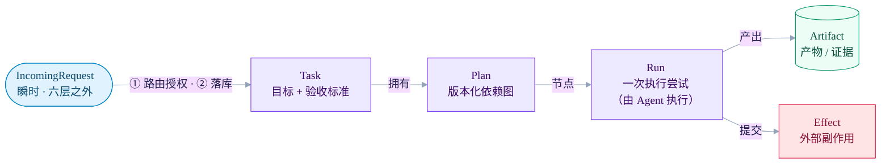

| 对象 | 定义 | 从属关系 |
|---|---|---|
| `Task` | 预期结果、约束、负责人、验收标准 | 由 ② 层据请求创建；一个 Task 可被多次请求跨渠道推进 |
| `Plan` | 推进 Task 的版本化依赖图 | 隶属一个 Task |
| `Run` | 推进某个计划节点的一次尝试 | 隶属一个 Plan 节点，由 Agent 执行 |
| `Artifact` | 可版本化的产物或证据：剧本、调研、图片、草稿 | 由 Run 产出 |
| `Effect` | 改变外部世界的动作：发送、发布、保存、提交 | 由 Run 提交，需幂等边界 |

`Agent` 是接收边界明确 WorkOrder 的执行者，它**执行 Run 但不拥有 Run**，故不列入这条对象链。

**请求是触发器，不是事实。** `IncomingRequest` 不进数据库：① 层只做路由与能力校验、不建对象，② 层据其新建/推进 Task。因此同一个 Task 可以今天在聊天室发起、明天用 CLI 补充——请求是多条临时的，Task 是一条持久的（呼应 §2 把渠道适配器放在六层之外）。

**三种"计划"必须严格分开**，分属不同层、持久化程度不同：

| 计划 | 所属层 | 持久化 | 示例 |
|---|---|---|---|
| `TaskPlan` | ② | 必须持久化、可版本化 | "写剧集 → 审查连续性 → 生成分镜" |
| `ExecutionPlan` | ③ | 必须 checkpoint | "将第 3 场交给编剧，再交给审查者" |
| `ReasoningPlan` | ④ | 短暂存在或压缩摘要 | "先读取角色 bible，再设计冲突" |

Agent 可提出 `PlanPatch`，但不能直接改全局 `TaskPlan`；由 ② 层校验并版本化被接受的变更，让项目始终可解释、可恢复。

### 3.3 ③ 编排与协作层：单 Agent 与多 Agent

第 ③ 层调度计划节点、决定用单还是多 Agent、做委派与汇总。它有四项核心职责：

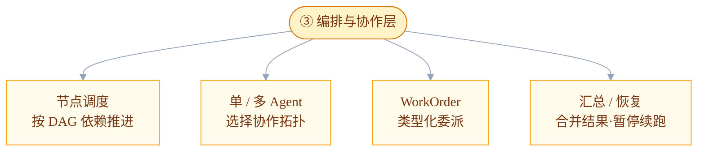

多 Agent 不是新运行时、也不是模型群聊，而是 ③ 层基于同一套 Runtime 和类型化交接协议构建的协作拓扑。

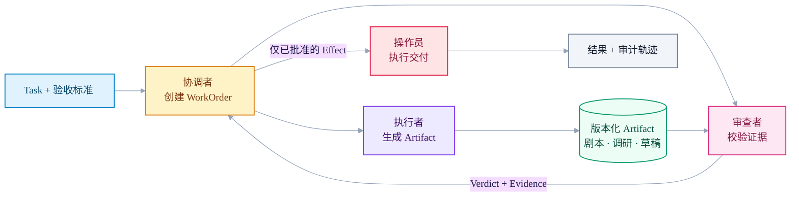

初始职责集合应保持很小：

| 角色 | 权限边界 |
|---|---|
| Planner | 提出或修订 `TaskPlan`；不能直接产生外部 Effect |
| Coordinator | 生成 WorkOrder、调度和汇总；不能静默篡改全局事实 |
| Worker | 完成一个边界明确的 Task 节点并产出 Artifact；不能改写全局 Plan |
| Reviewer | 依据验收标准返回 Verdict 与证据；不能审批自己创建的产物 |
| Operator | 执行已授权的 Effect；不能决定策略或修改内容 |

Agent 只能通过类型化对象协作：`WorkOrder`、`Artifact`、`ReviewVerdict`、`PlanPatch`、`EffectIntent`；自由形式的对话不是系统契约。

默认单 Agent，仅当满足任一条件时升级为多 Agent：Plan 有可独立执行的节点、创作与审查须独立、不同节点需不同知识/模型/工具/预算、项目长期运行需清晰归属。

### 3.4 ④ 单 Agent Runtime 层：模型调用与上下文工程

第 ④ 层是隔离的单 Agent 执行环境，**不能改全局计划、也不能提升权限**。它有四项核心职责：

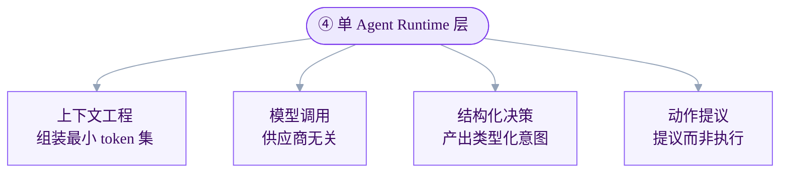

其中最难的是上下文工程，展开如下。

记忆平面（§4.2）回答"存什么、谁能读"，上下文工程回答"每一步实际喂给模型哪些 token"——这是 ④ 层组装工作记忆的核心职责。上下文是有限资源，token 越多召回越差（context rot），目标始终是**信噪比最高的最小 token 集**。

长周期任务必然超出单次上下文窗口，需要三种可组合策略：

| 策略 | 做法 | 何时用 |
|---|---|---|
| 压缩 | 近上限时摘要历史、重建窗口，但保留架构决策、验收标准、未解决问题；最轻量形式是清理已消费的工具结果 | 高频来回的对话式推进 |
| 结构化笔记 | 里程碑写入持久笔记（`NOTES.md`、待办），按需拉回，而非全靠窗口记住 | 达成里程碑、跨 Run 续接 |
| 子 Agent 隔离 | 子 Agent 用干净上下文做子任务，只回传 1~2K token 摘要，而非全部中间过程 | 并行调研、多节点协作 |

按需检索优于预加载：④ 层应通过轻量标识符（Artifact 引用、记忆 scope、文件路径）**渐进式加载**上下文，而非开局就把整个角色 bible 灌进 Prompt——这与 §3.1"知识是策略，不是巨型 Prompt"是同一反模式的两面。

三种策略都不得丢弃**可追溯性**：被压缩的原始事实仍以 Artifact 留在证据平面，摘要保留 `source_ref` 回链。

### 3.5 ⑤ 运行控制与治理层：Agent 自主性外侧的确定性边界

第 ⑤ 层是 Agent 自主性外侧的确定性边界。它有四项核心职责：


这四项归为两个不混淆的关注点——运行安全（能不能继续跑）与治理授权（这个动作允不允许）：

| 关注点 | 示例 | 决策 |
|---|---|---|
| 运行安全 | 最大轮数、执行时间、工具调用预算、无进展阈值、重复动作/结果、委派深度 | 继续、收口、暂停、取消 |
| 治理与授权 | 身份、能力范围、数据敏感度、收件人/域名规则、审批策略 | 允许、拒绝、要求审批 |

#### Guardrail：入口与出口双向拦截

授权决定"动作允不允许"，Guardrail 决定"这段输入/输出该不该进出流程"。两者互补，分布在三个位置：

| 位置 | 拦什么 | 例子 |
|---|---|---|
| 输入 Guardrail | 进入 Runtime 前的请求 | 提示注入、越权/越范围、有害或跑题输入 |
| 工具 Guardrail | 工具调用前后 | 危险参数、超范围收件人；可拦截、替换、改写 |
| 输出 Guardrail | 交付前的产物 | 敏感信息泄漏、不合规内容、格式违约 |

输入 Guardrail 此前薄弱：应在**首个 Agent 开跑前**拦截，避免为本该拒绝的请求浪费算力；高成本/有副作用的流程用**阻塞式**、普通流程可**并行**跑、触发即中止。命中须产生可审计的拒绝理由，而非静默丢弃。

#### 人工介入（interrupt）：审批只是它的特例

不要把"审批"做成孤立的 UI 特例。它是一个通用原语的实例——**暂停 → 持久化 → 等待外部决定 → 恢复**。整个过程复用 §4.2/§4.3 的同一套 checkpoint 机制，因此可跨进程重启、可等数天、可审计：

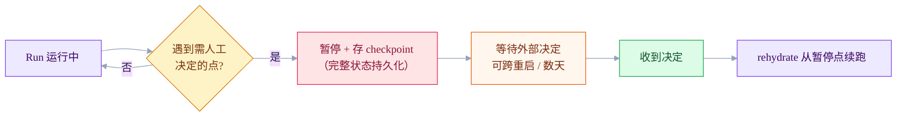

**触发时机不止审批**——任何需要"外部拿主意"的点都可 interrupt：

| 决定类型 | 场景 | 恢复后 |
|---|---|---|
| 批准 / 拒绝 | 高风险 Effect（发邮件、发布、删数据） | 批准则提交 Effect，拒绝则收口 |
| 二选一 / 多选一 | 有多个候选方案需人拍板 | 按所选分支继续 |
| 补充输入 | 缺关键参数或素材 | 带着补入的信息续跑 |
| 澄清歧义 | 事实/需求有歧义，猜错代价大 | 按澄清结果继续 |

所以"审批高风险 Effect"只是 interrupt 最常见的形态。统一到这一原语后，长周期项目里的"等用户拍板"才能像审批一样被持久化、恢复、审计——而不是把 Run 卡死或丢弃。

#### 防死循环需要多道闸门

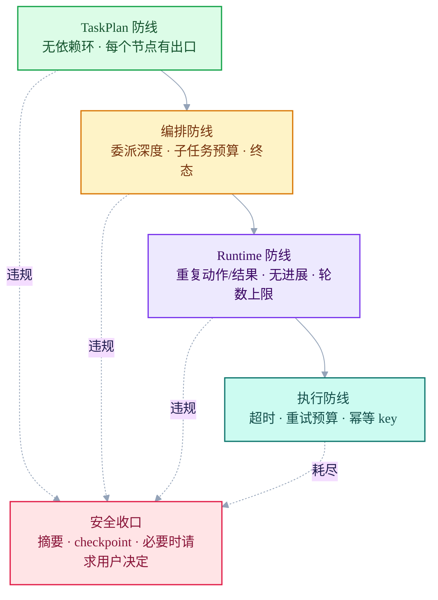

现有 `RunPolicy` 的概念（轮数、工具调用、墙钟时间上限，重复动作/结果，无进展阈值）都属于这一层，且必须随 Run 持久化，不能只存在于模型循环的局部变量里。

### 3.6 ⑥ 能力与交付层：Skill、工具与副作用

第 ⑥ 层实现具体能力，**只执行，不决定动作是否被允许**（那是 ⑤ 层的事）。它有四项核心职责：


Skill 是可复用、可版本化的工作单元：① 层授权，⑥ 层实现。

```python
@dataclass(frozen=True)
class SkillManifest:
    id: str
    version: str
    input_schema: dict
    output_schema: dict
    required_capabilities: set[str]
    readable_artifact_types: set[str]
    produced_artifact_types: set[str]
    acceptance_checks: list[str]
    risk_level: str
```

示例：

- `write_episode_script` 消费故事 bible，产出版本化剧本 Artifact；
- `review_continuity` 消费剧本和角色事实，产出带证据的结构化 Verdict；
- `send_email` 消费已批准草稿，创建一个幂等的外部 Effect。

Skill 永远不能绕过控制层：即使被授予 `send_email`，在具体 Run 中仍可能被 ⑤ 层拒绝、限流或转入审批。

外部工具与数据源统一走 **MCP（Model Context Protocol）** 接入，作为跨 Agent 复用的标准通道，避免为每个工具写一次性胶水。但 MCP 只是 ⑥ 层的一种能力适配器：接入的工具同样要有 `SkillManifest`、声明所需能力、并受 ⑤ 层授权与 Guardrail 约束——MCP 扩大了工具来源，不放宽任何控制边界。

外部 Effect 使用 outbox 和稳定的 idempotency key。重试或恢复时，绝不能重复发送邮件或重复发布同一 Artifact（恢复语义见 §4.3）。

## 4. 横切平面：状态、证据、记忆、观测与评测

横切平面不属于任何单层，而是**六层每一层都会读写**的公共底座。三大平面各司其职：


| 平面 | 保存什么 | 为什么需要 |
|---|---|---|
| 💾 数据与证据 | Task、Plan、Run、WorkOrder、Artifact、Effect、checkpoint | 恢复、溯源、审批、可复现 |
| 🧠 记忆与知识 | 用户、Agent、项目、Task、会话记忆；知识索引与访问策略 | 个性化、连续性、可控复用与知识隔离 |
| 📊 观测与评测 | 结构化事件、trace、模型/工具版本、token/cost、场景集、回放报告 | 排障、审计、安全升级模型/Prompt/Skill |

三者是有层次的：**数据与证据是原始事实，记忆是其派生，观测记录整个过程。**

观测与评测不能只是"事后能查"，必须**闭环、连回版本门禁**：模型、Prompt、Skill、策略的升级，都先在固定场景集上跑可回放评测，结果作为发布 gate。

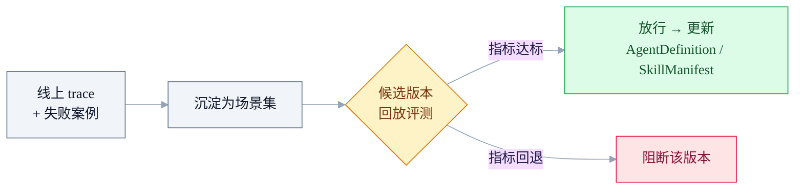

指标至少覆盖：是否达成验收标准、工具调用次数与错误率、token/成本、延迟；判定用确定性断言或 LLM-as-judge。这是 §6"升级前必须通过可回放场景评测"的落地机制。

`Artifact` 是可追溯的原始事实和产物；`Memory` 是从中提炼、可检索可纠正的派生认知。记忆不能替代 Artifact 作事实源，须保留 `source_ref` 回链。

### 4.1 记忆与知识平面

记忆按**作用域与生命周期分层**，呈包含关系——外层范围越大、生命周期越长，把内层更短命的记忆包住；不能把所有聊天、模型输出、工具结果都无脑写成长时记忆。

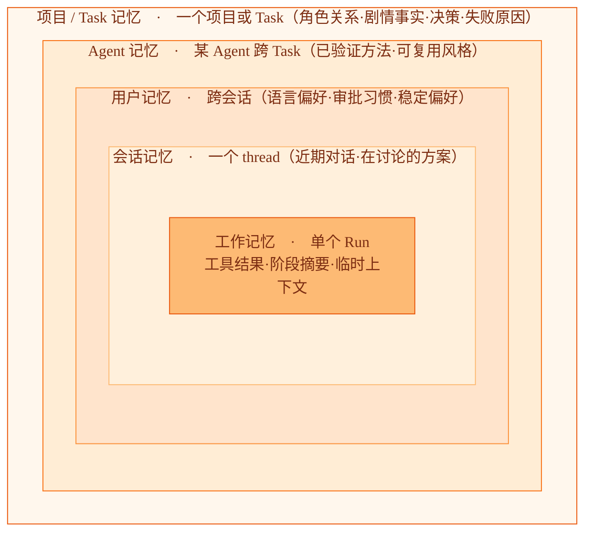

> 从内到外：生命周期越来越长（单次 Run → 永久项目事实），作用域越来越广（一个 Run → 整个项目）。内层记忆是外层的短命子集。

每条记忆至少应拥有以下契约：

```python
@dataclass(frozen=True)
class MemoryRecord:
    scope: str          # user / agent / project / task / thread / run
    kind: str           # preference / fact / decision / episode / summary
    content: dict
    source_ref: str     # 对应 Artifact、Run 或用户输入
    confidence: float
    sensitivity: str
    ttl: str | None
    version: int
    write_policy: str
```

记忆的读写规则按层划分：

- ① 层的 `knowledge_policy` 声明 Agent 可读写哪些记忆域；
- ② 层维护项目和 Task 的决策记忆；
- ③ 层只共享 WorkOrder 所需的最小记忆，不把 Agent 上下文全部互相注入；
- ④ 层按 scope 检索记忆并组装工作记忆；
- ⑤ 层强制租户隔离、隐私、保留期限和写入权限；
- ⑥ 层 Skill 只能产出"候选记忆"，不能绕过记忆服务直接写入全局事实。

影响项目事实的记忆不能直接落库，须经校验才能**晋升**为长期记忆；冲突、失效、用户纠正都保留版本记录：

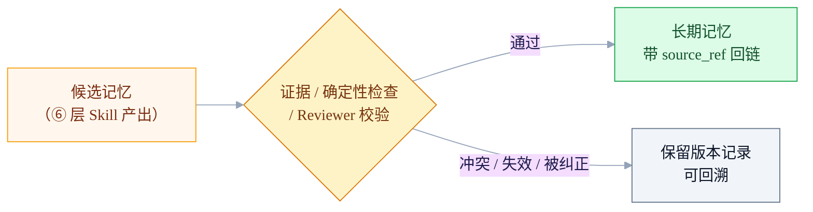

**校验通过≠原样落库。** 记忆库若把每条候选都堆进去，很快会膨胀、重复、自相矛盾。落库前须经一道**压缩**：同一 scope 下按 `kind` 归并——新证据合并进已有记忆、过期的降权或加 `ttl`、冲突的以高 `confidence`/新版本覆盖旧版本（旧版仍留版本记录）。这与 §3.4 的上下文压缩同源，但对象不同：

| | §3.4 上下文压缩 | §4.1 记忆落库压缩 |
|---|---|---|
| 压缩对象 | 喂给模型的 token 窗口 | 写入记忆库的长期记忆 |
| 目的 | 单次运行的信噪比 | 记忆库不膨胀、不冲突 |
| 触发 | 近上下文上限时 | 每次记忆晋升落库时 |

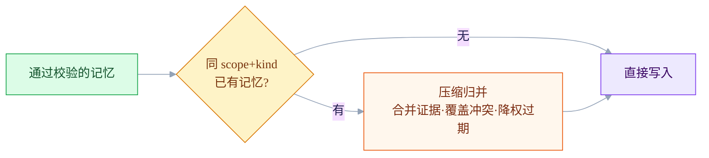

压缩不得丢弃可追溯性：归并后仍保留各条的 `source_ref` 与被覆盖版本，随时可回溯到原始 Artifact。

### 4.2 checkpoint 边界

checkpoint 是正在跑的 Run 的**存档点**：在关键节点把状态（当前计划节点、工作记忆摘要、已产出 Artifact 引用）持久化进数据与证据平面。它是"可恢复、可审计"承诺的物理基础，支撑三件事：

- **恢复**：崩溃/重启后从最近 checkpoint 续跑，跳过已完成步骤，不从头重来（见 §4.3）；
- **人工介入**：停下等审批时把状态存成 checkpoint，人回来后从该点 rehydrate 继续（见 §3.5）；
- **审计/复现**：每个 checkpoint 是可回溯快照，能还原"某一步当时的状态"。

存档不能太稀（否则一断丢很多进度），也不必每行都存。**最小 checkpoint 边界**是保证任意中断都能从不太远处续上的必存时机：

| # | 触发时机 | 存档意义 |
|---|---|---|
| 1 | `TaskPlan` / `ExecutionPlan` 变化 | 计划演进可回溯、可回滚 |
| 2 | 发出一个 WorkOrder | 委派了什么、给了谁有记录 |
| 3 | 记录一个模型决策 | 恢复时不重复推理 |
| 4 | 提交一个工具结果或 Artifact | 已完成的产出不重跑 |
| 5 | Run 进入审批 / 暂停 / 终态 | 中间态可持久等待、可恢复 |
| 6 | 提交一个 Effect | 配合幂等 key，恢复时已发的不重发 |

### 4.3 恢复与重放

checkpoint 只解决"存"，恢复要解决"崩溃后怎么续"。核心原则：**加载最近 checkpoint，逐步续跑；每一步按"能否安全重放"分流处理，绝不重复已完成的副作用。**

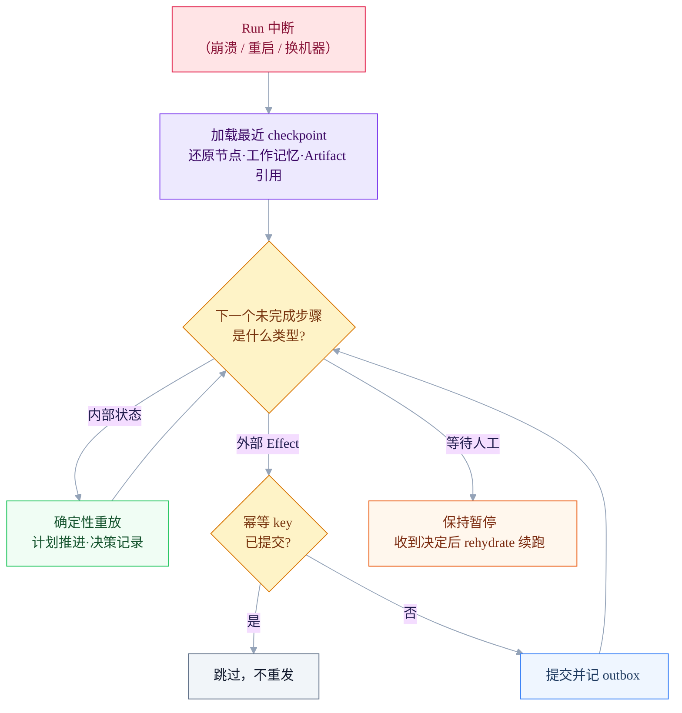

分三种情况处理，取决于该步骤**能否安全重放**：

| 步骤类型 | 能否重放 | 恢复方式 |
|---|---|---|
| 内部状态（计划、决策、工作记忆） | 能 | 从 checkpoint 确定性重放，结果与首次一致 |
| 外部 Effect（发送、发布、提交） | 不能 | 靠 outbox + 幂等 key 去重，已提交则跳过、绝不重发 |
| 等待人工（审批、interrupt） | —— | 保持暂停的中间态，收到决定后 rehydrate 续跑（见 §3.5）|

**为什么内部状态能"确定性重放"？** 因为编排与决策逻辑不含随机副作用——同样的输入（checkpoint 里的状态）重跑得到同样的结果。真正不可重放的是"改变外部世界"的 Effect，所以架构把两者严格分开：内部状态尽管重放，外部 Effect 一律走幂等边界。这与 §6"外部 Effect 没有幂等边界不得重试"互为表里——**幂等边界既服务重试，也服务恢复。**

## 5. 本仓库的实现方向

现有代码是有价值的参考，而不是目标架构本身：

| 现有组件 | 在目标架构中的位置 |
|---|---|
| `HarnessRunner`、`HarnessContextManager`、`RunPolicy` | ④ 层 Runtime，以及 ⑤ 层的运行安全部分 |
| `ChatHarness` | `chat_assistant` 的一种渠道/产品适配 |
| `BaseLoop`、`LoopEngine`、`scheduler.py` | ②/③ 层的早期 Task 推进与触发基础设施 |
| `effects.py` | ⑥ 层的第一版 Effect / outbox 实现 |
| memory | 记忆与知识平面的起点；需要补 scope、来源、版本与读写策略 |
| run records、conversation records | 数据与证据平面的起点 |
| `engine/tools/*` | Skill Registry 下方的能力适配器 |

第一个实现里程碑不是多 Agent，而是定义持久化契约：`AgentDefinition`、`Task`、`Plan`、`Run`、`Artifact`、`Effect`、`WorkOrder`，然后让现有单 Agent Harness 使用它们。多 Agent 协作应是同一套契约上的受控扩展。

## 6. 不可妥协的规则

- Agent 不得绕过注册能力和控制闸门，直接拥有 shell、网络或发布权限。
- Worker 不能直接改全局 Plan，只能带证据提出 `PlanPatch`。
- Reviewer 不能审批自己创建的 Artifact。
- 外部 Effect 没有幂等边界不得重试。
- 审批不是 UI 特例，而是可持久化的 Run 状态。
- 模型、Prompt、Skill 或策略升级前，必须通过可回放的场景评测。
